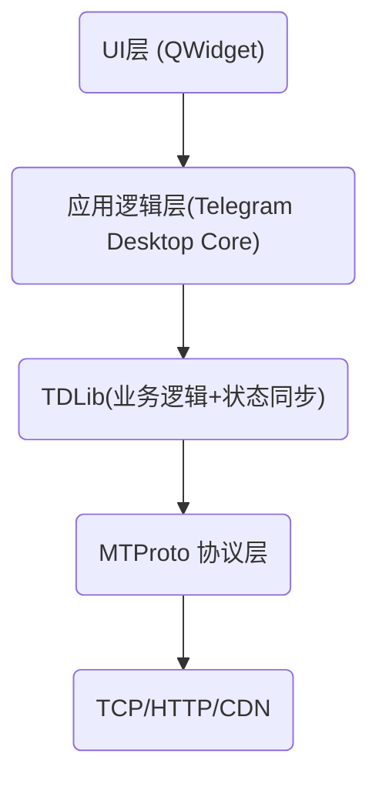
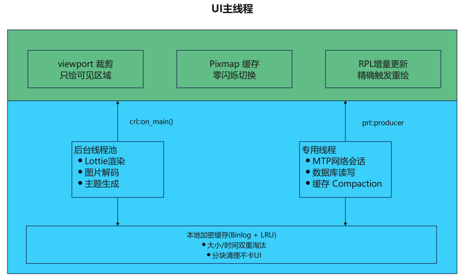

# Telegram 运行流畅且高效的原理分析

[toc]

## 1 整体架构层：高解耦 + 高内聚

`Telegram` 并不是一个 "UI 直接调网络" 的简单结构，它是分层非常清晰的：



**流畅性的架构全景**



**关键思想**

1. UI 和网络彻底解耦
2. 所有状态变化都由 TDLib 驱动
3. UI 只是“**订阅状态变化**”

这是一种类似：

- React 状态驱动 UI
- Rust Redux-like 架构
- 现代响应式架构

**带来的好处**：

- UI 不阻塞
- 网络波动不影响渲染
- 所有状态可缓存

## 2 网络层：MTProto 的高性能设计

Telegram 使用的是自研协议：**MTProto**， 它比 `HTTP / gRPC` 更适合高频即时通信。

:one: **​二进制协议**

**不是 JSON，不是 protobuf 文本**

而是：

```sql
TL Schema -> 二进制编码
```

**优点**

- 极小 payload
- 无字符串字段名
- 减少解析开销
- 更少 CPU cache miss

:two: 长连接 + 多路复用

Telegram 使用：

- 长 TCP 连接
- 自己实现 multiplexing
- 自己实现 ack 管理
- 自己实现消息重发

不像 HTTP2 那样依赖标准库

这样做的结果：

- 更低协议栈开销
- 更细粒度控制
- 避免 head-of-line blocking

> [!important] 
>
> MTProto 协议
>
> 专门为移动端和桌面端设计的二进制协议，极其精简，序列化/反序列化速度远超 JSON 或 XML。

:three: 分层数据同步

它不会：

- 每次全量拉取
- 也不会 REST 查询

而是：`状态版本号 + 差量更新`

服务器维护：

```bat
pts
qts
seq
date
```

客户端只拉增量

这使得：

- 打开软件几乎秒开
- 同步非常快

> [!important]
>
> ### 异步网络与 MTProto 协议栈
>
> 1. 完全异步的请求模型
>
> - 每个数据中心（DC）拥有独立的 Session 运行在专用 QThread 上
>
> - 请求使用 Builder 模式，天然非阻塞：
>
> ```c++
> _api.request(MTPmessages_GetHistory(...))
> .done([=](const MTPmessages_Messages &result) { /* 主线程回调 */ })
> .fail([=](const MTP::Error &error) { /* 错误处理 */ })
> .send();
> ```
>
> 2. 多 DC 并行连接
>
> - 支持同时连接多个数据中心，下载时多个 Session 并行工作
>
> - DownloadManagerMtproto 追踪每个 Session 的性能，自动剔除慢连接
>
> 3. 智能重试策略
>
> - 指数退避：1ms → 2ms → 3ms → 1s → 2s → ... → 64s
>
> - 自动 CDN 回退，带哈希校验
>
> - 连接状态实时反馈给 UI（"正在连接..."/"X秒后重试"）

## 3 UI 渲染层：为什么滚动极其流畅？

Telegram Desktop 用 Qt，但比普通 Qt 软件流畅很多。

原因有几个：

:one: ​**自绘控件（重度自定义）**

几乎所有控件：

- 聊天气泡
- 滚动区域
- 动画
- 列表

都是自绘的

没有使用：

- QTableWidget
- QStandardItemModel 这种重型模型

而是：**轻量数据结构 + 自绘**

优点：

- 减少 QObject 数量
- 减少信号槽开销
- 减少虚函数调度
- 更少 heap 分配

> [!important]
>
> - 放弃了复杂的 Qt 原生 Widget 嵌套，转而使用自定义的 Painter 直接调用底层的绘图 API;
> - 这种“所见即所得”的绘制方式省去了 Widget 管理带来的巨大 CPU 开销。


:two: **​虚拟列表（只渲染可见区域）**

聊天记录不是全部 QWidget

而是：只保留可见区域 item

类似：

- React Virtual List
- Qt Quick ListView
- 浏览器 DOM 虚拟化

避免：

- 几万条消息 = 几万个 QWidget

这是流畅的关键。

> [!important]
>
> **主要原理**
>
> 在 ListWidget::paintEvent 中，程序利用二分查找 (std::lower_bound), 结合预先计算好的高度，只绘制当前视口可见的消息。
>
> 聊天历史窗口 HistoryInner::paintEvent()中：
>
> - 使用`enumerateItems()`仅遍历当前可见区域内的消息
> - 屏幕外的消息完全跳过绘制，即使聊天有十万条消息，每帧也只处理几十条

:three: **​精细化重绘控制**

Telegram 避免：

```
update() 大范围刷新
```

而是：

- 精确计算 dirty rect
- 最小区域 repaint
- 控制动画帧率

减少 GPU/CPU 压力

> [!important]
>
> **主要原理**
>
> 1. 组件化组合 (Runtime Composer)
>    - 消息元素使用 RuntimeComposer 模式
>    - 消息不是复杂的继承树，而是由简单的组件动态组合而成，极大地降低了内存占用和对象创建开销
> 2. 激进的缓存策略
>    - 复杂的 UI 元素（如带圆角的按钮背景、头像等）会被预先渲染并缓存为 QImage, 在绘制时直接进行像素拷贝
>    - 所有的文本布局（Text Layout）和位置计算都是在后台预先完成并缓存的
>    - 多级缓存渲染
>
>      - Widget 级 Pixmap 缓存：页面切换时将旧/新内容预渲染为位图，实现零闪烁过渡
>
>      - 头像缓存：PeerUserpicView 基于尺寸、形状、调色板版本做精确失效判断
>
>      - 图片多尺寸缓存：Image 类内部用 flat_map<uint64, QPixmap> 按参数组合缓存不同分辨率
>
> 3. 流畅的动画系统
>
>    - Ui::Animations::Simple 提供插值动画，支持多种缓动曲线（easeOutCirc、sineInOut 等）
>
>    - Lottie 动画在 后台线程 渲染帧，使用 4 帧环形缓冲区（kFramesCount = 4），主线程仅负责显示
>
>    - 相同动画的多个实例共享渲染状态
>
> 4. OpenGL 加速
>
>    - 媒体查看器使用 OpenGL 渲染路径（media_view_overlay_opengl）
>
>    - 纹理缓存、Buffer 复用、Shader 缓存
>
>    - 支持 YUV420/NV12 视频格式的硬件解码
>
> 5. 自定义触摸滚动
>
>    - Ui::ScrollArea 实现了带物理加速/减速的触摸滚动
>
>    - 速度追踪、最大速度限制（4000px/s 加速、2500px/s 快划）
>
>    - 滚动到目标位置也有动画过渡

## 4 内存与数据结构优化

Telegram 代码风格有一个特点：

> 极度避免“无意义对象”

例如：

- 少用 shared_ptr
- 少用虚继承
- 少 RTTI
- 少异常

大量使用：

```C++
unique_ptr
flat containers
small object optimization
```

并且：

- 尽量减少 heap 分配
- 复用对象
- 使用 arena / object pool

这对桌面应用流畅度影响非常大。

> [!NOTE]
>
> 实现代码中的示例
>
> - **自定义内存管理**   在关键路径上使用内存池和 base::flat_map 等紧凑型数据结构，减少缓存缺失（Cache Miss）和内存碎片
> - **rlottie 动画引擎** 使用三星开源的 rlottie 渲染矢量动画，比传统的 GIF 或视频更省 CPU，且支持硬件加速
>
> **内存精细管理**
>
> 1. 智能清理策略
>
> - 聊天历史支持 ClearType::Unload：从内存中卸载但保留数据库记录
>
> - 导航历史限制条目数量（kMaxChatEntryHistorySize），超限时 FIFO 淘汰
>
> - 缓存清理分块执行（clearStaleChunk()），避免大批量删除卡顿 UI
>
> 2. 安全的所有权模型
>
> - std::unique_ptr：Widget、HistoryItem 等独占资源
>
> - std::shared_ptr：PhotoMedia、DocumentMedia 等共享媒体数据
>
> - base::weak_ptr + base::make_weak()：异步回调中防止悬空引用
>
> - crl::guard()：跨线程回调前检查对象存活
>
> 3. 稀疏数据结构
>
> - 消息列表使用 Storage::SparseIdsList，仅存储 ID 而非完整对象
>
> - 按需实例化完整消息体

## 5 并发模型：不会阻塞 UI 线程

Telegram 的线程模型大概是：

```
UI Thread
Network Thread
Worker Thread Pool
File IO Thread
```

关键点：

- UI 线程几乎不做重计算
- 网络解析不在 UI 线程
- 图片解码不在 UI 线程
- 加密不在 UI 线程

并且：

- 使用 async 回调驱动
- 没有大锁
- 没有 UI 等待

> [!important]
>
> 主要实现方式如下：
>
> - **任务分级**  Telegram 将任务分为不同优先级。网络请求、数据库读写、媒体处理分别运行在不同的专用队列中
>
> - **无锁/轻量级锁**  在 lib_crl 的实现中，尽量减少了传统互斥锁的使用，转而使用 GCD (macOS) 或高效的线程池 (Windows/Linux) 来管理任务竞争
>
> - **lib_crl (Concurrency Runtime Library)**
>   -  这是 Telegram 的并发运行库。它提供了一套轻量级的异步任务调度机制，通过 crl::async 将耗时操作（如图片解码、文件 IO、拼写检查等）极速分发到后台线程，确保主线程（UI 线程）永远不被阻塞
>
>   1. 主线程调度：crl::on_main()
>
>      - 与 Qt 事件循环深度集成，通过 MainQueueProcessor 投递自定义 QEvent 来驱动主队列
>
>      - 所有 UI 更新都通过此机制安全地回到主线程
>
>   2. 后台任务分发：crl::async()
>
>      - 平台自适应实现：Windows 用 WinAPI 线程池、macOS 用 GCD、Linux 用 QThreadPool
>
>      - 耗时操作（主题处理、文件 I/O）全部在后台执行
>      - 线程绑定对象：crl::object_on_thread<T>
>
>      - 数据库、网络会话等拥有独立线程，通过 with() 方法安全地在其线程上执行操作
>
>      - 配合 weak_on_thread / weak_on_queue 防止跨线程悬空指针
>      - 无锁数据结构
>
>      - 任务队列使用 无锁链表（std::atomic<BasicEntry*> + CAS 操作），避免锁竞争
>
>      - 使用 std::atomic_flag 防止重复唤醒
>
> - **lib_rpl (Reactive Programming Library)**
>   - 响应式编程库。Telegram 使用 rpl::variable 和事件流来管理状态。当底层数据变化时，UI 会通过响应式链条自动、精准地更新，避免了冗余的刷新和复杂的通知逻辑。
>
>   - rpl::producer 是整个应用的数据流核心，带来了两个关键优势：
>
>     - 精确的增量更新
>
>       - UI 不依赖轮询，而是订阅数据变化流
>
>       - 数据变更时只触发相关订阅者的重绘，而非整体刷新
>
>       - rpl::combine 合并多个数据源，任一变化即触发更新
>
>     - 自动的生命周期管理
>
>       - rpl::lifetime 在对象销毁时自动取消所有订阅（回调逆序执行）
>
>       - 配合 Widget 的 lifetime() 方法，订阅与 UI 组件生命周期绑定
>
>       - 从根本上杜绝了因忘记取消订阅导致的内存泄漏和野指针回调
>
> - **lib_base**  包含了高度优化的算法和数据结构，例如 algorithm.h 中针对特定场景优化的容器和搜索算法  

## 6 分层缓存与懒加载架构

1. 消息懒加载

- 聊天历史按"切片"加载（每次 20-50 条消息）

- 双向加载：loadMessages()（向上）和 loadMessagesDown()（向下）

- preloadHistoryIfNeeded() 在用户滚动到边界前预加载

- 打开聊天时定位到未读位置（loadAroundId()），而非加载全部
- 图片渐进式加载

- 三级状态：CacheNotLoaded → CacheThumbLoaded → CacheLoaded

- 先显示模糊缩略图，再异步加载高清图

- 每个分辨率独立缓存
- 媒体流式传输

- 视频/大文件使用 128KB 分块下载（kDownloadPartSize）

- 流媒体读取器将文件分为 ~8MB 的"切片"，内存中仅保留 2 个切片

- 播放点前方预加载 1MB 数据
- 本地加密缓存数据库

- Storage::Cache::Database 使用 Binlog 写前日志

- 支持大小限制（totalSizeLimit）和时间限制（totalTimeLimit）双重淘汰

- 后台 Compaction 避免数据库膨胀

- 下载前先查本地缓存（tryLoadLocal()）

## 7 加密效率

MTProto 的加密是：

- AES-IGE
- DH key exchange
- 轻量封装

并且：

- 使用 CPU AES 指令
- 使用 OpenSSL 优化路径
- 批量处理数据

不像很多 App 每条消息都高层封装。

## 8 启动速度为什么快？

原因：

1. 本地缓存完整
2. 本地有会话状态
3. 不需要请求配置
4. 差量同步
5. UI 先渲染缓存数据

所以：

- 秒开
- 即使断网也能浏览历史

## 9 为什么不卡？

总结核心原因：

| 普通软件        | Telegram       |
| --------------- | -------------- |
| REST API        | 自研二进制协议 |
| JSON            | TL 二进制      |
| 全量同步        | 差量同步       |
| 大量 QWidget    | 自绘轻量结构   |
| 重度信号槽      | 轻量回调       |
| UI 线程解析网络 | 完全分离       |
| STL map         | 优化容器       |
| 频繁 heap 分配  | 对象池         |

## 10 从工程哲学角度总结

Telegram 快的根本原因：

> 它把“即时通讯”当成一个操作系统级系统在做，而不是 CRUD 应用。

它更像：

- 一个 mini OS
- 一个专用分布式系统客户端

而不是：

- Qt + REST 的普通桌面程序