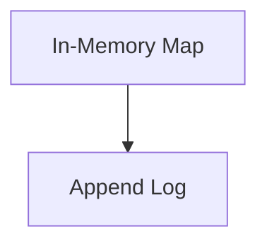

# lib_storage 实现原理及实现机制梳理

[toc]

在分析 Telegram Desktop 的 `lib_storage` 模块之前，先给一个整体判断：

> **Telegram 的文件存储设计核心思想：顺序写 + 内存映射 + Append-Only 日志结构 + 批量提交 + 轻量级索引。**
>  本质是一个偏 LSM / WAL 思想的嵌入式高性能 KV 存储。

## 1 lib_storage 在整体架构中的定位

在 Telegram Desktop 中：

- `lib_storage` 是本地持久化模块
- 用于：
  - 本地消息缓存
  - 媒体索引
  - 对话状态
  - 用户信息
  - session 信息
  - 配置缓存

**特点：**

- :x:不依赖 SQLite
- :x:不依赖 RocksDB
- :white_check_mark:自研轻量存储
- :white_check_mark: 针对“聊天场景”高度定制

它不是通用数据库，而是：

> 高吞吐、低延迟、频繁小数据写入优化的本地日志存储引擎。

## 2 整体设计思想

`lib_storage` 的核心设计类似：



核心原则：

:one: **​顺序写优于随机写**

磁盘性能：

- 随机写 = 慢
- 顺序写 = 快（尤其 SSD）

Telegram 使用：

```c++
append-only file
```

所有更新都写入文件尾部。

:two: **WAL 模型（Write Ahead Log 思想）**

每次写入：

```c++
[Header][Key][Value][CRC]
```

崩溃恢复：

- 读取日志
- 逐条重放
- 构建内存索引

这和数据库 WAL 机制一致。

> lib_storage 的核心思路可以概括为：“小索引内存化 + 值分文件存储 + Binlog 追加日志 + 异步清理/压缩”，在保证加密与一致性的前提下，把随机写放大降到较低。

## 3  模块结构（按职责）

- storage/storage_encrypted_file.*：统一的加密文件读写抽象（AES-CTR、块对齐、文件锁、头校验）。

- storage/cache/storage_cache_database_object.*：缓存数据库核心实现（put/get/remove、索引、淘汰、打包写、触发 compact）。

- storage/cache/storage_cache_binlog_reader.*：Binlog 的流式分块解析器（支持多种记录类型）。

- storage/cache/storage_cache_compactor.*：日志压缩器（把“历史操作流”收敛成“当前状态快照流”）。

- storage/cache/storage_cache_cleaner.*：版本目录清理器（异步删旧版本目录）。

- storage/storage_databases.*：数据库实例复用/生命周期管理（同路径复用，异步等待 cleaner 后销毁）。

## 4 高效存储实现原理

:one: **数据与索引分离**

- 每个 value 存成独立数据文件（随机 PlaceId 映射到路径），主 Binlog 只记录 key -> place,size,checksum,tag,time。

- 优势：更新某 key 不需要重写大索引文件，只追加一条记录 + 写新值文件。

:two: ​**追加写 Binlog（append-only）**

- 写入是追加 Store 记录；删除/访问时间更新分别追加 MultiRemove / MultiAccess。

- 通过“追加而非原地修改”降低随机 IO 和崩溃恢复复杂度。

:three: **​批量打包减少 syscall**

- _removing 和 _accessed 会聚合成 Multi* 批记录，延迟写入（writeBundleDelay）或达到上限立即写。

- 典型收益：高频小操作合并成少量顺序写。

:four: **​内存索引常驻**

- _map<Key, Entry> 常驻内存，读路径先查内存，再直接打开对应 value 文件。

- 不扫盘、不遍历日志，读延迟稳定。

:five: **​写入去重/短路**

- put 时先比对 tag/size/checksum，必要时还会读旧值做内容比对；完全相同则跳过物理写与日志写。

- 避免重复写热 key。

## 5 关键机制（保证性能与一致性）

:one:**​增量恢复**

- 打开时只顺序读 Binlog，重建 _map（不是扫整个数据目录），恢复速度与日志长度线性相关。

:two: **​后台 Compaction**

- 当“日志冗余字节”超过阈值（compactAfterExcess 等）触发 compact：

  - 从旧 Binlog 读 key 流；

  - 向数据库要“当前生效 Entry”；

  - 写入新紧凑 Binlog（只保留最终状态）。

- 结束后还有 CatchUp：把 compact 期间新增日志尾巴补到新文件，尽量无缝切换。

- 失败采用指数退避重试，避免反复抢资源。

> 由于 append-only 会导致：
>
> ```c++
> key1 old
> key1 new
> key1 new
> ```
>
> Telegram 定期做：
>
> ```c++
> compact
> ```
>
> 流程：
>
> ```mermaid
> graph LR
> A(新建文件)-->B(只写最新版本)
> B-->C(替换旧文件)
> ```
>
> 类似 LSM-tree 的 level 合并。

:three: **​淘汰策略（时间 + 容量）**

- 维护估算访问时间 useTime，支持：

  - 超时淘汰（totalTimeLimit）；

  - 超容量淘汰（totalSizeLimit，优先移除最旧）。

- 大批量删除按 chunk 异步进行（staleRemoveChunk），避免长时间阻塞。

:four: **​版本目录切换 + 旧版本异步清理**

- 使用 version 文件指向当前活跃目录，clear 或换代时切新目录；

- Cleaner 后台删旧目录，前台继续服务，降低停顿。

:five: **​文件级并发安全**

- FileLock 保证写互斥；

- 错 key/损坏通过 header/checksum 检测并返回明确错误类型

## 6 加密与磁盘布局的效率点

:one:**​ AES-CTR 流式块处理**

- 块大小 16B，对齐读写，非对齐部分走 padding；
- 适合随机 seek + 顺序追加。

> [!note]
>
> 关于 AES 算法的梳理，请参见《AES算法梳理》。

:two: **​文件头最小化校验**

- 头里含 salt、format、checksum；
- 快速判定 key 是否正确、格式是否兼容。

:three: **​目录散列式分布**

- PlaceId 转两级路径（首字节做子目录）以分散单目录文件数，减轻文件系统压力