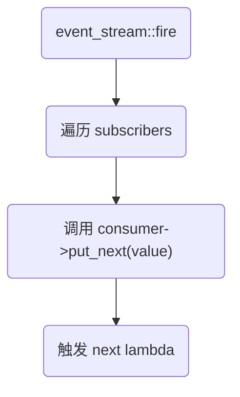
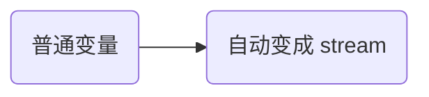
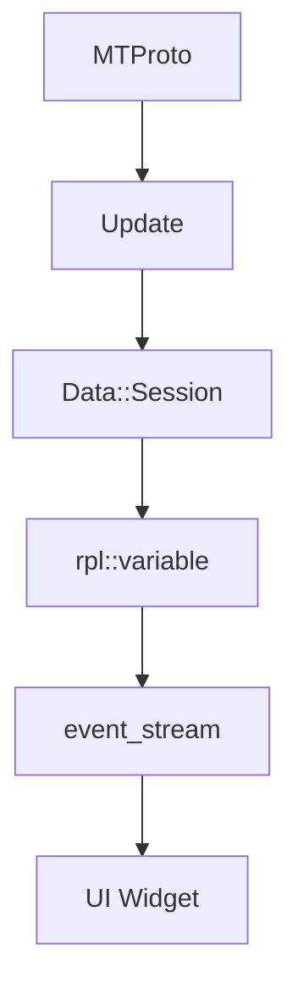

# rpl event_stream 的实现机制及运行原理分析

[toc]

在 Telegram Desktop 中，`event_stream` 属于其自研的响应式库 **rpl（Reactive Programming Library）** 的核心抽象之一。它本质上是一个 **push-based 冷/热可组合数据流**，大量用于 UI 更新、状态同步、网络事件分发。

## 1 event_stream 的本质

在 rpl 里核心角色是：

- `producer<T>` —— 可订阅的数据源
- `consumer<T>` —— 订阅者
- `lifetime` —— 生命周期控制
- `event_stream<T>` —— 主动可发射事件的 producer

可以理解为：

```c++
event_stream<T>  ≈  可手动 fire 的 producer<T>
```

它是一个 **hot stream（热流）**。

### 1.1 event_stream 的定位

event_stream 是一个可主动推送的事件总线，与普通 producer 的区别是：

- producer：懒求值，只有订阅后才由 Generator 按需产生值

- event_stream：推送式，谁持有 stream 就主动 fire_* 发出事件，所有订阅者会收到

也就是：把“一次性或异步到来的事件”转成“可订阅的流”。

## 2 event_stream 内部运行机制

核心结构可以抽象为（简化理解）：

```c++
template <typename T>
class event_stream {
public:
    void fire(T value);
    producer<T> events();
};
```

内部结构为：

```c++
template <typename T>
class event_stream {
private:    
    struct Data {        
        std::vector<consumer<Value, Error>> consumers;        
        int depth = 0;    
    };    
    std::weak_ptr<Data> make_weak() const;    
    mutable std::shared_ptr<Data> _data;
};
```

- `Data`：共享结构，存当前所有订阅者（consumers）和递归深度（depth）
- `_data` 用 `shared_ptr`，保证 `stream` 自身被拷贝时仍共享同一组 consumers。

真实实现当然更复杂，但逻辑大致是：

:one: **内部保存 subscriber 列表**

event_stream 内部维护一个订阅者链表：

```c++
std::vector<consumer<T>*> _subscribers;
```

当：

```c++
producer.start(next, error, done)
```

会：

- 创建一个 consumer
- 注册到 event_stream
- 与 lifetime 绑定

------

:two: **fire() 触发流程**

当调用：

```c++
_stream.fire(value);
```

执行流程是：



这是典型的：

> 同步 push 模型

:warning: Telegram 的 rpl 默认是同步的（除非你显式切线程）。

## 3 数据是如何转换为 stream 的

Telegram 中几乎所有“状态变化”都会包装为 stream。

------

### :one:最基础方式：手动 fire

例如：

```c++
rpl::event_stream<int> _count;

void setCount(int value) {
    _count.fire(value);
}
```

对外暴露：

```c++
rpl::producer<int> count() const {
    return _count.events();
}
```

这就是：

> [!note]
>
> 传统 `setter` $\rightarrow$ `stream`

------

### :two:把状态变量变成 reactive variable

Telegram 内部大量使用：

```C++
rpl::variable<T>
```

它是：

```c++
variable<T> = value + event_stream<T>
```

简化模型：

```c++
class variable<T> {
    T _value;
    event_stream<T> _changes;
    lifetime _lifetime;
};
```

当：

```c++
var = newValue;
```

内部做：

```c++
_value = newValue;
_changes.fire(newValue);
```

于是：




> [!important]
>
> 这就是 Telegram UI 自动刷新的核心机制。

------

### :three: 把多个数据源组合成 stream

例如：

```c++
combine(
    user.name(),
    user.status(),
    [](auto name, auto status) {
        return name + status;
    });
```

内部原理：

```c++
多个 producer
    ↓
订阅所有源
    ↓
任意一个变动
    ↓
重新计算 lambda
    ↓
fire 新值
```

这类似：

- Rx 的 combineLatest
- C++20 ranges 的 view pipeline
- FRP 模型

## 4 网络数据如何变成 stream？

在 `Telegram Desktop` 中：

1. MTProto 网络线程收到更新
2. 转换为 Update 对象
3. 投递到主线程
4. 写入 Data Model
5. Data Model 的 variable 触发 stream
6. UI 订阅 stream 自动刷新

流程图：



这就是：

> [!note]
>
> `网络数据` $\rightarrow$ `业务对象` $\rightarrow$ `reactive variable`$\rightarrow$ `stream` $\rightarrow$ `UI`

## 5 event_stream 和 consumer 的真正关系

当：

```C++
producer.start(...)
```

内部：

1. 构造一个 consumer
2. consumer 保存 next/error/done
3. 注册到 event_stream
4. lifetime 销毁时自动移除

consumer 本质就是：

`一个函数集合` + `生命周期钩子`

`event_stream` 不知道 `lambda`
 它只知道：我有一组 `consumer`
## 6 为什么 Telegram 流畅？

以 Telegram Desktop 为例，它流畅的关键在于：

### :one:不是全局刷新

不是：

数据变  :arrow_right: repaint 全部

而是：

数据变 :arrow_right: 只 `fire` 对应`stream` :arrow_right: 只刷新订阅者​

### 2️⃣ 无锁设计

UI 线程基本不加锁：

- 数据在主线程修改
- stream 同步触发
- 无额外线程调度

### :three: 组合而不是回调地狱

UI 代码写法类似：

```C++
label->setText(
    user.name()
    | rpl::map(...)
);
```

这让 UI 成为：***`函数式声明`***
而不是：

`onUserChanged` $\rightarrow$ `if` $\rightarrow$ `update` $\rightarrow$ $\cdots$

## 7 总结

在 Telegram 中：

| 原始数据 | 如何变成 stream         |
| :------: | ----------------------- |
| 普通变量 | 包装成 rpl::variable    |
|  setter  | 手动 fire               |
| 网络消息 | 转为模型字段 → variable |
| 多源数据 | combine/map/filter      |

核心思想只有一句话：

> [!important]
>
> 所有“变化”都必须通过 stream 发射出来。